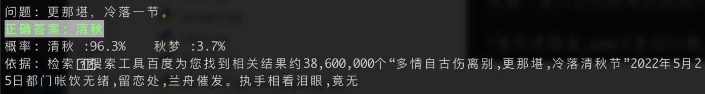
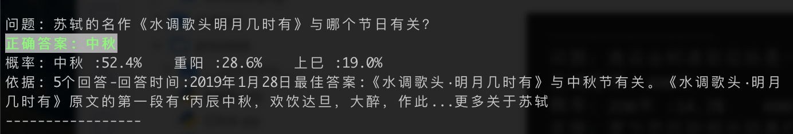
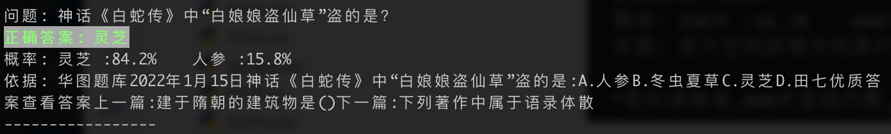
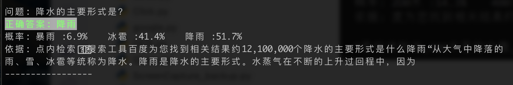
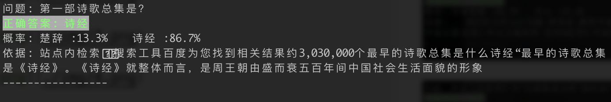

# 微信读书每日一答辅助

## 功能描述
简单的说就是每隔一段时间截张图，去百度搜答案。

## 配置环境
- Python 3.10.4
- 微信Macos版  
- 百度AI平台

## 原理
1. 截图
2. OCR识别问题和答案
3. 根据问题去百度搜答案
   
    > 选择答案的依据是，以问题作为关键字进行搜索，在搜索结果的首页中，选择出现频率最高的答案作为候选结果，并把它的上下文作为依据。
4. 自动寻找答案位置并作答
5. 循环执行1，2，3，4

## 使用方法

**注**：
> 因为Macos没办法获取到小程序的窗口，所以需要手动测量小程序窗口大小，调整题目和答案位置。  
> 文件位置：`process/ScreenCapture.py`
> 截图效果会输出在`output/images`目录下，可参考校对位置


1. 登陆[百度AI开放平台](https://console.bce.baidu.com/ai/#/ai/ocr/app/list)，创建一个通用场景OCR应用(每天免费1w次够用了)，并在应用列表中查看AppID，API Key和Secret Key
2. 打开百度网站登录，复制出cookie
2. 在根目录下仿照configdemo.json创建一个config.json文件，把上面得到的值填进去
3. 用**电脑**打开微信读书小程序，并**保持在最前**，且不要被遮挡
4. 运行根目录下的main.py
5. 进入每日一答页面开始答题，隔一段时间控制台就会输出结果：












---

仅供学习参考，这玩意正确率目测80-90%，也不是标准答案，不能保证完全正确。
目前的最大的瓶颈还是在于**速度**，速度不够快即使答对了，也不能保证赢。**暂时也没有想到好的方案解决**
```text
自动化答题总时间 = 截图时间 + OCR时间 + 搜索引擎查询时间 + 自动化答题时间
```

## 致谢
[@maotoumao](https://github.com/maotoumao)